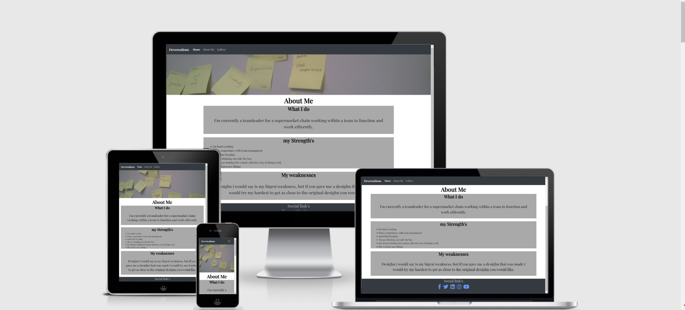

# My Personal Portfolio Website

[View my finished project](#)

This is my personal portfolio website. I am designing to be responsive and accessible on multiple types of devices.

# User Experience (UX)

## User stories

* First time visitor goals

    1. The first time entering the site I would like people to know exactly what the site is about and what it is for.

    2. The first time visiting the site I would like to be able to navigate with ease.

    3. The first time visiting to  the site I would like navigate to specific page I’m looking for.

* Returning visitor goals

    1.	As a returning visitor I would like to be able to locate contact information with ease.

    2.	As a returning visitor I would like to see past projects you have contributed to.
    
    3.	as a returning visitor I would like to be able to find social media links to see what current projects you have been working on.

* Frequent user Aims

    1. I would like to have a sign in page where you can create and log in.
    
    2. An emailing box to submit project requests with descriptions.
    
    3. A page that covers your current project you are working on.

* Desighn

    * Colour Scheme
        
        * im planning to use a off white color scheme and mot to many bold colour's to avoid over stimulating the user, this simple colour scheme is easy to mannage and change when required.
    
    * Typography

        * google fonts was used to style the text

    
    * Imagery 

        * I am using google images for all imagery for the site, and only using creative commons license images.

* Wireframe

    * [link to my wireframe pdf](wireframe.pdf)

# Features

* responsive desighn accross desctop mobile and tablet(hoping to improve on this as i learn more).

# Technologies Used 

* HTMLE5

* CSS3

* Bootstrap was used to aid in the responsive desighn and speed development up and aid i the desighn

* balsamiq was used for the wire frame desighn.

* google fonts has been used to style the text

* google images was used to provide images for the site with creative commons licens to avoid any plagarisome and law breaking

* git was used for the repository and deploment of the site and to push and comit to.

* github was used to store the code 

* git pod was used to write and create the code as well as preview the site.

* googles light house dev tool was to check the usabilitay and accesibility of the site as well as seo raiting

# Testing

* WC3 Validatore was used to check for any errors in the code which the score was for css results link is http://jigsaw.w3.org/css-validator/validator?uri=https%3A%2F%2Fzylo-ds.github.io%2FMS1-Project%2F&profile=css3svg&usermedium=all&warning=1&vextwarning=
and for html the only error was with the boot strap button still trying to understand how to solve this issue.

# testing user experiance

* i wanted people to know how to navigate and look around the site which i believe i have achieved

* i didnt want visitors to the site to take a long period of time to find what there looking for.

# what i would like to achieve in the future development of my site.

* i would like too add a sign in page 

* a automatick contact me email for for requsting colaborations/ work together.

* i would also like to update this page with some projects iv worked on during my code institute course.

# Deployment

* the deployment of the site was done through git hub pages which has caused an issue with my place holder images not displaying and only displaying the alt tag. I was unable to find a soloution for this befor my milestone project submision this will be an issue i will try and fix when i know how to.
 
 # known bugs or issues 

 * the git deployment not displaying my gallery corect 

 * i had some positioning bugs which was soved by altering code where some spaces had been missed or code hadnt been typed corectly

 # Credits

 ## Code
 
 * i have used some code from a few of the projects on code institue learning program and have adapted it to suit the need i required 

 * boot strap 4 was used to aid in responsive desighn

 # Content 

 * The immages are not my own the where aquired on google immages with the filter creative commons license.

 # Acknowledgements

 * to code institute for learning material provided which aided in edditing code and using it on my own project 

 * google images.
 
 * fontawsome for providing access to free images/logos for the site.